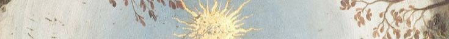

<!-- Header -->
<h1 align="center">Hi, I'm Sara Souissi</h1>
<h3 align="center">Advanced Technologies Engineering Student</h3>

<!-- Background section -->

  

  

## About Me
- Advanced Technologies **engineering student**
- Completed a **full-stack web development internship** building modern websites
- Creative, adaptable, and can working **under pressure**
- Enjoys designing
- Still learning and constantly improving

## Tech Stack

  

## Community & Clubs
- Actively involved in college clubs and events  
- Use my technical and creative skills to **support club projects**
- Roles include **HR Manager**, **Marketing Member**, and technical contributor  
- Love learning from teamwork and helping others grow

